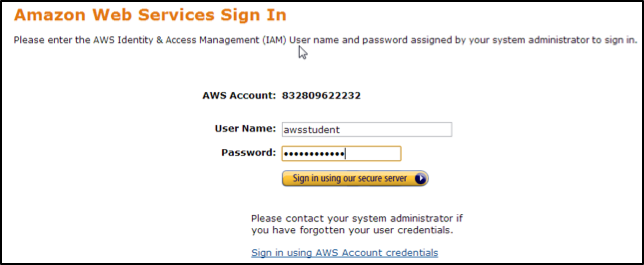
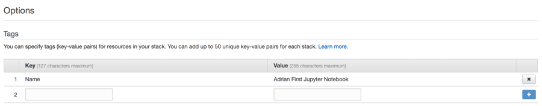

# Jupyter Notebooks on AWS
## Introduction

In this lab you will be introduced to Jupyter Notebooks on AWS. [Jupyter](http://jupyter.org/) provides a user-friendly and easy-to-use interactive programming environment in a web browser. Jupyter runs very well just about anywhere. You can run it on your laptop, your desktop machine, or in the AWS cloud.

By running Jupyter Notebooks on AWS, you can take advantage of infrastructure web services you might not normally have access to. For example, using Jupyter on AWS you might want to use:

- Large memory instances, e.g. up to 2TB RAM instances (x1 or r4 families)
- Compute optimized instances, e.g. up to 36 vCPUs (c3 or c4 families)
- NVIDIA GRID GPUs (g2 family)
- NVIDIA K80 GPUs (p2 family)
- Spark, Hadoop on Amazon Elastic MapReduce (EMR)
- HPC clusters (AWS Batch and CfnCluster)

Essentially you can take advantage of any of the very powerful capabilities made available to you on AWS. 

## Technical Knowledge Prerequisites

To successfully complete this lab, you should be familiar with the following:

- Basic Amazon EC2 and AWS CloudFormation concepts
- Basic familiarity with the Python and R programming languages
- Basic familiarity with Git and Github.com

## Topics Covered

This lab will take you through:

- Creating Jupyter Notebook environments on AWS
- Using very simple notebook examples to step through and interactively run code in your Jupyter Notebook environment on AWS

## Sign in to the AWS Management Console

Using your AWS account to sign in to the AWS Management Console
Welcome to this self-paced lab! The first step is for you to sign in to Amazon Web Services.

1. In this lab we are going to use your existing AWS account. Prior to the lab you will have been given an IAM user with a username and password, and a URL to the AWS IAM console login screen. Browse to that URL and use the username and password credentials to login into the AWS console.  
  
  

2. **AWS Region** – all the work you do today will be in a single AWS region. Please check with the lab instructor which AWS region you should use.

## Creating an Amazon EC2 Key Pair

1. Browse to the EC2 console
2. In the left hand navigation menu, under the ‘Network & Security’ section, click **Key Pairs**
3. Click the **Create Key Pair** button
4. Give your Key Pair a unique name, e.g. **jupyter-lab**
5. Click the **Create** button

The EC2 console will now download the private key for your newly created key pair. Before we can use the private key we’ll need to update the permissions on it. To do this type:

    chmod 0400 jupyter-lab.pem

Don’t lose this and store is in a safe place! It effectively authenticates you when using AWS programmatically. You don’t want someone else impersonating you or using your credentials. We’ll be using this private key later in the lab.

# Module 1 – Creating your Jupyter Notebook environment

We describe the detailed step-by-step process used to create an automated Jupyter environment on AWS in our [Creating and Using a Jupyter Instance on AWS](https://d0.awsstatic.com/WWPS/PDF/AWS_Jupyter_Instance_Whitepaper_v6.pdf) whitepaper.

For the scientific researcher, engineer, or technical user, being able to quickly start up a server instance for running applications, writing code, or even post-process data is one of the great things about Amazon Web Services (AWS). One of the most common tools used for developing and maintaining applications is Jupyter. Jupyter allows interactive data science and scientific computing across 40 different programming languages. It allows researchers to share/exchange live code, data sets, and visualization so that they can collaborate more efficiently. These are called notebooks, and their use is growing.

In this module you’ll use an example Jupyter environment we have created and tested for you. We have implemented this using AWS CloudFormation to make it really easy to create and manage the lifecycle of your very own notebook environment on AWS.

## Creating your Notebook environment

The CloudFormation template that will create this notebook environment for you is available publicly,

	https://s3-ap-southeast-2.amazonaws.com/scico-labs/templates/jupyter.json

We’re going to use this template to create our first cluster. To do this:

1. Click on the URL above, and download the template to your local computer. This will be saved as a file **jupyter.json**
2. In your web browser, go to the AWS CloudFormation console
3. Click the **Create Stack** button
4. In the “Choose a template” section, select **Upload a template to Amazon S3** and click **Choose File**
5.	Browse to the location where you downloaded the template (remember the file will be called “jupyter.json”), and select that file
6.	Click the **Next** button

The next screen gives you an opportunity to change the behaviour of your template by using CloudFormation parameters. We’re going to make a few minor changes here.

1. In the **Stack name** field enter a unique name for your Jupyter environment. E.g. use your first name, something like “adrian-jupyter”.  

Then, in the Parameters section, for:  

2. the **KeyName** field, select your keypair you created earlier
3. the **SubnetId** field, select **subnet-6b48760e** (172.31.0.0/20)
4. the **VpcId** field, select **vpc-6c7b3209** (172.31.0.0/16)

Then, click the **Next** button

The next screen allows us to tag our Jupyter Notebook environment. We can use whatever metadata we like here, in the form of key-value pairs. I’d suggest giving your notebook a meaningful name so you can find it later (e.g. when you have multiple notebooks or other AWS resources running).

To do this:

1. In the **Key** field, enter “Name”
2. In the **Value** field, enter a descriptive name for your cluster, e.g. “First Jupyter Notebook”  

You should see something like this:

3. Once you’ve done this, click the Next button.
4. You have an opportunity to review your CloudFormation configuration and make changes if you wish.
5. Click the **Create** button.

AWS CloudFormation will now go off and do a lot of work for us. If you browse back to the CloudFormation console, you should see a new stack being created. This is your first notebook environment being built. Select the stack and inspect the **Events** tab in the pane on the bottom half of the screen. CloudFormation is doing all this work for us so we don’t have to. 
The CloudFormation template builds the notebook for us very quickly. In about 60 seconds, you’ll have a completely configured and ready to run Jupyter environment on AWS.

## Using your Notebook environment

Jupyter provides a web interface for us to interact with. We’ll use this and become familiar with some of the functions it provides in this section.

From the CloudFormation console, browse to the **Outputs** tab in pane at the bottom of the screen. You should see a number of pieces of information about your Jupyter Notebook environment. The one we care about is the **JupyterURL** key. The value of the key is the URL we will use to access the Jupyter Notebook in our web browser. Open this link in a new tab.

If everything worked successfully, you should see something like:

There are a number of things we can check now. At the top right of the Jupyter application we can see a **New** dropdown. Click on that. You should see a number of options to create a new text file, a new terminal and so on. We also have the option of creating three different types of notebooks; a Julia, Python, and R notebook. These environments and programming languages have been installed for you by default.

The other main navigational element we want to learn about is the tabs across the top of the Jupyter application; the **Files**, **Running**, and **IPython Clusters** tabs.

The **Files** tab is the default view, and shows us the files and folders within our Jupyter environment. As we create new notebooks and modify their configurations new files will appear here. Think of this as your Jupyter home directory.

The **Running** tab shows you the Terminals and Notebooks you are currently running. You can have multiple terminal sessions and notebooks running at the same time.

The **IPython Clusters** tab allows you to configure your notebook environment to do parallel computing using Python. IPython Clusters is an example of a Jupyter Notebook extension. We have installed and configured this for you by default.

Getting some code to run in our Notebook
Example notebooks have been created and made available on Github.com at,

    https://github.com/scicolabs/jupyter-aws

We are going to use this a baseline to start exploring running code interactively in our new Notebook environment. To do this we’ll open a new Terminal session, and use the Git command-line environment to clone the examples above to our Jupyter environment.

To do this,

1. Click on the **New** dropdown menu at the top right of your Jupyter environment
2. Select **Terminal**
3. This will open a Linux Bash shell in your web browser! From here you can run command line tools to do whatever you’d like within your Jupyter environment.
4. We’ve already installed the git tools for you, so let’s clone the Github repository. To do this, copy the following command line and paste it into the Terminal session.

	``git clone https://github.com/scicolabs/jupyter-aws.git``
	
If the command was successful you will see some status information and something looking like,

This command has cloned the jupyter-aws Github repository and made the contents available to us in our Jupyter environment.
Browse back to the Jupyter Files tab. You should see a new folder called ‘jupyter-aws’. Click on that folder, and then click on the ‘labs’ folder within it. The ‘labs’ folder contains a number of saved notebooks we can run.

For example, let’s try interactively running the Building fractals with x86.ipynb notebook. Clicking on that file will load the notebook. You should see something like,

Scroll down and have a look at the notebook. We’ll dissect this into pieces later. Firstly, let’s run the entire notebook. To do this, use the new menu across the top; **File, Edit, View, Insert, Cell, Kernel** and **Help**.

1. Click on **Cell**
2. In the dropdown, click on **Run All**

If you pay careful attention you’ll notice that some cells have a number in square brackets next to them. These are the cells that have completed execution. Some cells will have an asterisk in square brackets. These cells are still running. The screenshot below demonstrates this,

Here you can see that the 3rd cell to execute has finished. This cell defined a function ``mandel`` in Python. The cell below it which defines the function ``create_fractal`` is still running.

The result of this simple little Python notebook is a Mandelbrot fractal that is displayed back to you within the notebook! Jupyter is quite powerful like this, you can return results, both images and datasets for example directly within the notebook you’re running. This make interactively building and running code much easier, as you can see the result of your code almost immediately.

## Checking the status of our notebook environment

Now that we’ve done something useful in our Jupyter environment, let’s go back to the original Jupyter tab in our browser and click on the **Running** tab at the top of the page.
Here you’ll notice that we have a running Terminal session and an active Notebook as well (the Python notebook we were interactively drawing fractals in).

You can control the lifecycle of both of these by clicking the **Shutdown** button next to either one.

## Saving your Notebook

One important thing you’ll want to do often is to save your notebook. To do this from within a running notebook, use the **File** menu and click **Save and Checkpoint**. As you save and checkpoint regularly, you’ll then be able to revert back to previous versions of your notebook by again using the **File** menu and clicking **Revert to Checkpoint**. You’ll be presented with a list of all the checkpoints for the current notebook.

## Sharing your Notebook

Jupyter notebooks make it very simple collaborate with other researchers. You might work hard on building a new data mining program and want to share that with a collaborator. One way to do this would be to give them access to your Jupyter environment. A better, and perhaps more secure way would be to download your notebook and share it with them via Github.com or even email. This means they could then run a copy of your notebook in their Jupyter environment, and you could continue working in yours uninterrupted.

To download the current notebook use the **File** menu and select **Download as**. You can probably see a number of options including; Notebook (.ipynb), Python (.py), HTML (.html) and so on.

For a collaborator to use your notebook easily, you’ll want to select the first option, Notebook (.ipynb). Selecting this option will prompt you to save a new file to your local computer. This file will be a self contained copy of the current notebook that you can then send to whoever you wish.

If you have finished the introduction above, feel free to experiment with the other notebooks in the labs folder. You’ll notice some won’t run due to missing dependencies. You can either fix those missing dependencies, or perhaps explore the Awesome Data Science playlist mentioned in Module 2.

You may also choose to start writing some R or Julia notebooks. Feel free to start playing around with your new Jupyter notebook environment on AWS!

# Module 2 – Data Science with Jupyter

Now that you have a functional Jupyter environment you can start exploring other notebooks people have written. An excellent series of tutorials have been created using Jupyter to teach the basics of Data Science in Python. [The Awesome Data Science](https://www.youtube.com/playlist?list=PLyBBc46Y6aAxkGS2KdE6db0Sw3ixvTFAx) YouTube video tutorial is a wonderful place to start learning about this topic.

All the tutorials mentioned in this video tutorial series are available in their [Github repository](https://github.com/alfredessa/awesomedata.science) as well.

# Summary

Congratulations! You’ve created and used your first Jupyter Notebook environment on AWS. This is just the beginning! You can run Jupyter notebooks on larger instances, or instances with GPU capability. You can use Jupyter to run big data analytics using Amazon EMR, and you can even control HPC clusters from the comfort of your Jupyter Notebook as well.
Your AWS account team would also love to hear about your use case and what you’re looking to do with AWS.

**Have fun, and remember, don’t forget to the turn your AWS resources off when you leave the room!**

# Additional Resources

Creating and Using a Jupyter Instance on AWS

	https://d0.awsstatic.com/WWPS/PDF/AWS_Jupyter_Instance_Whitepaper_v6.pdf

Run Jupyter Notebook and JupyterHub on Amazon EMR

	https://aws.amazon.com/blogs/big-data/running-jupyter-notebook-and-jupyterhub-on-amazon-emr/

Research & Technical Computing at AWS

	https://aws.amazon.com/rtc

For feedback, suggestions, or corrections, please email Adrian White at **whiteadr@amazon.com**

