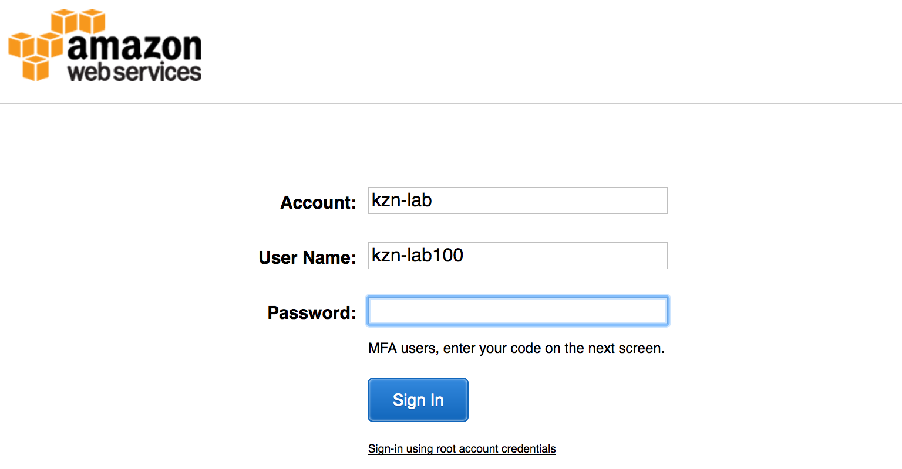
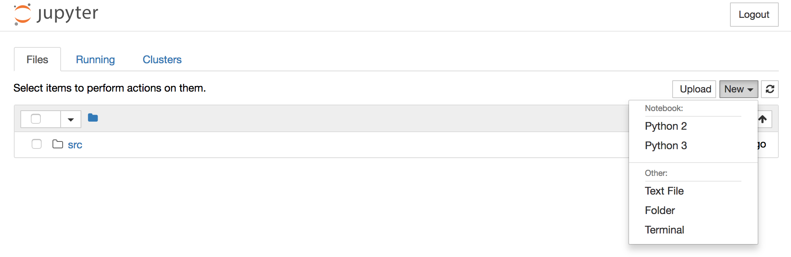
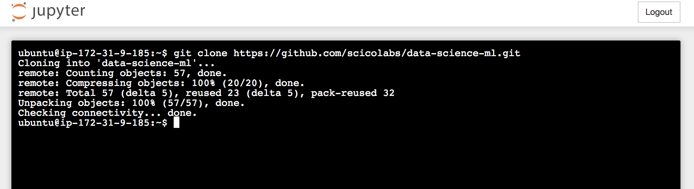
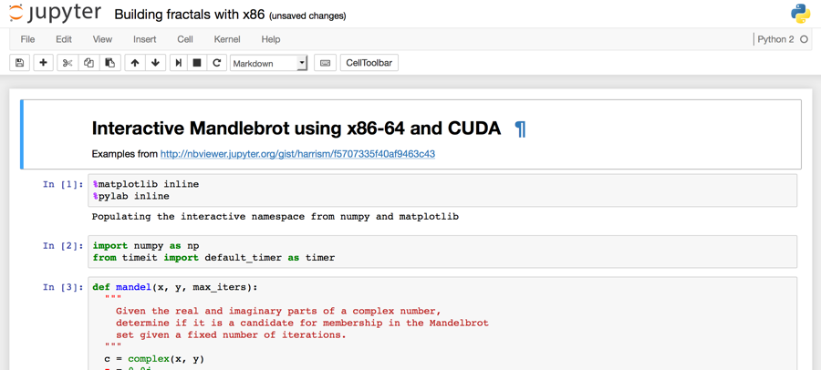
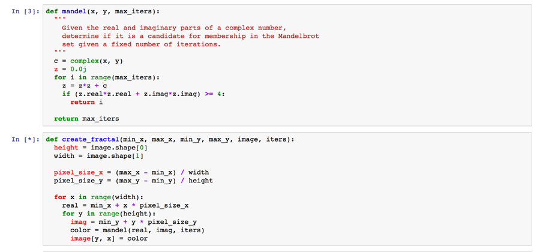
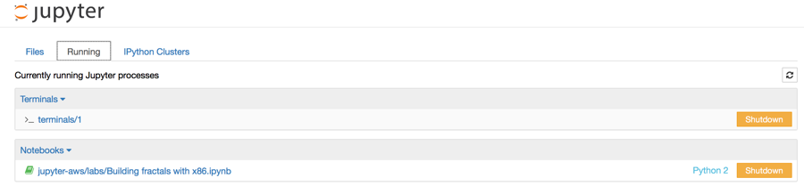

# Jupyter Notebooks on AWS
## Introduction

In this lab you will be introduced to Jupyter Notebooks on AWS. [Jupyter](http://jupyter.org/) provides a user-friendly and easy-to-use interactive programming environment in a web browser. Jupyter runs very well just about anywhere. You can run it on your laptop, your desktop machine, or in the AWS cloud.

By running Jupyter Notebooks on AWS, you can take advantage of infrastructure web services you might not normally have access to. For example, using Jupyter on AWS you might want to use:

- Large memory instances, e.g. up to 2TB RAM instances (x1 or r4 families)
- Compute optimized instances, e.g. up to 36 vCPUs (c3 or c4 families)
- NVIDIA GRID GPUs (g2 family)
- NVIDIA K80 GPUs (p2 family)
- Spark, Hadoop on Amazon Elastic MapReduce (EMR)
- HPC clusters (AWS Batch and CfnCluster)

Jupyter Notebooks also allow you to take your *code and analysis to the data*, rather than having to move large datasets to your tools (an increasingly difficult task for large and growing research data volumes).

Running Jupyter on AWS means you can be as proximate as possible to some of the most interesting [Open Data](https://aws.amazon.com/government-education/open-data/) sets in the world, like [Earth on AWS](https://aws.amazon.com/earth/), the [Cancer Genome Atlas](https://aws.amazon.com/public-datasets/tcga/), and many others. This combination means you can use some of the newest, and most powerful analysis tools and techniques right next to large datasets to do some pretty interesting things.

## Technical Knowledge Prerequisites

To successfully complete this lab, you should be familiar with the following:

- Basic Amazon EC2 and AWS CloudFormation concepts
- Basic familiarity with the Python and R programming languages
- Basic familiarity with Git and Github.com

## Topics Covered

This lab will take you through:

- Creating Jupyter Notebook environments on AWS
- Using very simple notebook examples to step through and interactively run code in your Jupyter Notebook environment on AWS
- Explore Apache MXNet to develop, train and evaluate deep learning models using GPUs in AWS

## Sign in to the AWS Management Console

Using your AWS account to sign in to the AWS Management Console
Welcome to this self-paced lab! The first step is for you to sign in to Amazon Web Services.

1. In this lab we are going to use your existing AWS account. Prior to the lab you will have been given an IAM user with a username and password, and a URL to the AWS IAM console login screen. Browse to that URL and use the username and password credentials to login into the AWS console.  
  
  

2. **AWS Region** – all the work you do today will be in a single AWS region. Please check with the lab instructor which AWS region you should use.

## Creating an Amazon EC2 Key Pair

1. Browse to the EC2 console
2. In the left hand navigation menu, under the ‘Network & Security’ section, click **Key Pairs**
3. Click the **Create Key Pair** button
4. Give your Key Pair a unique name, e.g. **jupyter-lab**
5. Click the **Create** button

The EC2 console will now download the private key for your newly created key pair. Before we can use the private key we’ll need to update the permissions on it. To do this type:

    chmod 0400 jupyter-lab.pem

Don’t lose this and store it in a safe place! It effectively authenticates you when using AWS programmatically. You don’t want someone else impersonating you or using your credentials. We’ll be using this private key later in the lab.

# Module 1 – Creating your Jupyter Notebook environment

We describe the detailed step-by-step process used to create an automated Jupyter environment on AWS in our [Creating and Using a Jupyter Instance on AWS](https://d0.awsstatic.com/WWPS/PDF/AWS_Jupyter_Instance_Whitepaper_v6.pdf) whitepaper.

For the scientific researcher, engineer, or technical user, being able to quickly start up a server instance for running applications, writing code, or even post-process data is one of the great things about Amazon Web Services (AWS). One of the most common tools used for developing and maintaining applications is Jupyter. Jupyter allows interactive data science and scientific computing across 40 different programming languages. It allows researchers to share/exchange live code, data sets, and visualization so that they can collaborate more efficiently. These are called notebooks, and their use is growing.

In this module you’ll use an example Jupyter environment we have created and tested for you. We have implemented this using AWS CloudFormation to make it really easy to create and manage the lifecycle of your very own notebook environment on AWS.

## Creating your Notebook environment

Today, we'll be using the Deep Learning AMI (Amazon Machine Image) provided by AWS to run Jupyter and also interact with commonly used deep learning frameworks and libraries.

The AWS Deep Learning AMIs are available in the [AWS Marketplace](https://aws.amazon.com/amazon-ai/amis/) or via the Amazon EC2 Console. We'll be launching the Ubuntu-based Deep Learning AMI via the Amazon EC2 Console.

To do this first make sure you've logged into the AWS Console, and browse to the EC2 Console. Then, from the EC2 Dashboard:

1. Click on the **Launch Instance** button
2. On the left hand navigation, click **AWS Marketplace**
3. In the search box, type 'Ubuntu Deep Learning', and hit Enter
4. Click the **Select** button
5. From the Instance Type screen choose either a 'g2.2xlarge' or a 'p2.xlarge'. Both of these are GPU instance types, which we'll use when we're training deep neural networks.
6. Click the **Next: Configure Instance Details** button, and leave all the default settings in place
7. Click the **Next: Add Storage** button, and leave the default storage settings in place
8. Click the **Next: Add Tags** button. These screen let's us tag our Deep Learning instance with metadata so we can find it again. In this case, click the **Add Tag** Button and add a Name field.
9. Click the **Next: Configure Security Group** button, and leave the default security group settings in place
10. Finally, click the **Review and Launch** button. This screen let's you check your instance configuration and review it before launching.
11. If you're happy with your configuration (you might want to check over it again just to be sure), click the **Launch** button
12. Here's you'll be prompted to select your key pair. Carefully select the keypair you created earlier, and click the **Launch** button.

Your new Deep Learning EC2 instance is now launching. It'll take a couple of minutes for this to complete. 

This is also how you generically create a new EC2 instance on AWS. There's quite a few customizations steps, but as you can see, you can safely accept many of the defaults.

## Using your Notebook environment

Jupyter provides a web interface for us to interact with. We’ll use this and become familiar with some of the functions it provides in this section.

### Setting up an SSH tunnel

To do this securely, we'll setup an SSH tunnel to our EC2 instance running Jupyter, and use that tunnel to connect to our remove server.

***OS X / Linux***

If you're using **OS X** or **Linux**, you can simply use the built in SSH client. To do this:

1. Open a terminal window
2. Make sure the permissions on your private key are correct (you should have done this when you created your key):  
  
`chmod 400 <<your_private_key.pem>>` 

and then type the following:  
  
`ssh -i <<your_private_key.pem>> -L 8888:localhost:8888 ubuntu@<<ec2_publicdns_name>>
`

Where,

**<<ec2_publicdns_name>>** is the DNS name for your EC2 instance
**<<your_private_key.pem>>** is the path to your private key you downloaded earlier

***Windows***

If you're using **Windows**, you can use the PuTTY program to connect to your EC2 instance over SSH and setup the SSH tunnel. To do this, follow [Setting up an SSH tunnel with PuTTY](http://realprogrammers.com/how_to/set_up_an_ssh_tunnel_with_putty.html).

What we are doing here is creating a secure tunnel between your local computer and the server. This means all traffic will be encrypted and we won't be exposing any unsecured public ports on the internet. This makes our connection to the Jupyter instance considerably more secure.

### Starting Jupyter

If you were able to open a tunnel, and SSH to your EC2 instance, you should now see an Ubuntu Linux terminal. We want to start Jupyter on our EC2 instance. To do this, type the following at a command prompt:

`jupyter notebook --no-browser`

That's it. If this is successful you should see something like the following output:

<pre>
$ jupyter notebook --no-browser
[I 05:59:15.982 NotebookApp] Serving notebooks from local directory: /home/ubuntu
[I 05:59:15.982 NotebookApp] 0 active kernels 
[I 05:59:15.982 NotebookApp] The Jupyter Notebook is running at: http://localhost:8888/?token=293b53862610e9d940370a4d6a07d4e890ba992313b2346a
[I 05:59:15.982 NotebookApp] Use Control-C to stop this server and shut down all kernels (twice to skip confirmation).
[C 05:59:15.982 NotebookApp] 
    Copy/paste this URL into your browser when you connect for the first time,
    to login with a token:
        http://localhost:8888/?token=293b53862610e9d940370a4d6a07d4e890ba992313b2346a
</pre>

If you now open a browser on your local machine and browse to:

`http://localhost:8888?token=293b53862610e9d940370a4d6a07d4e890ba992313b2346a`

you should see the Jupyter Notebook environment, like:s

There are a number of things we can check now. At the top right of the Jupyter application we can see a **New** dropdown. Click on that. You should see a number of options to create a new text file, a new terminal and so on. We also have the option of creating three different types of notebooks; a Julia, Python, and R notebook. These environments and programming languages have been installed for you by default.

The other main navigational element we want to learn about is the tabs across the top of the Jupyter application; the **Files**, **Running**, and **IPython Clusters** tabs.

The **Files** tab is the default view, and shows us the files and folders within our Jupyter environment. As we create new notebooks and modify their configurations new files will appear here. Think of this as your Jupyter home directory.

The **Running** tab shows you the Terminals and Notebooks you are currently running. You can have multiple terminal sessions and notebooks running at the same time.

The **IPython Clusters** tab allows you to configure your notebook environment to do parallel computing using Python. IPython Clusters is an example of a Jupyter Notebook extension. We have installed and configured this for you by default.

Getting some code to run in our Notebook
Example notebooks have been created and made available on Github.com at,

    https://github.com/scicolabs/jupyter-aws

We are going to use this a baseline to start exploring running code interactively in our new Notebook environment. To do this we’ll open a new Terminal session, and use the Git command-line environment to clone the examples above to our Jupyter environment.

To do this,

1. Click on the **New** dropdown menu at the top right of your Jupyter environment
2. Select **Terminal**
3. This will open a Linux Bash shell in your web browser! From here you can run command line tools to do whatever you’d like within your Jupyter environment.
4. We’ve already installed the git tools for you, so let’s clone the Github repository. To do this, copy the following command line and paste it into the Terminal session.

	``git clone https://github.com/scicolabs/jupyter-aws.git``
	
If the command was successful you will see some status information and something looking like,

This command has cloned the jupyter-aws Github repository and made the contents available to us in our Jupyter environment.
Browse back to the Jupyter Files tab. You should see a new folder called ‘jupyter-aws’. Click on that folder, and then click on the ‘labs’ folder within it. The ‘labs’ folder contains a number of saved notebooks we can run.

For example, let’s try interactively running the 'Building fractals with x86.ipynb' notebook. Clicking on that file will load the notebook. You should see something like,

Scroll down and have a look at the notebook. We’ll dissect this into pieces later. Firstly, let’s run the entire notebook. To do this, use the new menu across the top; **File, Edit, View, Insert, Cell, Kernel** and **Help**.

1. Click on **Cell**
2. In the dropdown, click on **Run All**

If you pay careful attention you’ll notice that some cells have a number in square brackets next to them. These are the cells that have completed execution. Some cells will have an asterisk in square brackets. These cells are still running. The screenshot below demonstrates this,

Here you can see that the 3rd cell to execute has finished. This cell defined a function ``mandel`` in Python. The cell below it which defines the function ``create_fractal`` is still running.

The result of this simple little Python notebook is a Mandelbrot fractal that is displayed back to you within the notebook! Jupyter is quite powerful like this, you can return results, both images and datasets for example directly within the notebook you’re running. You can also use HTML5 elements like <code>canvas</code> to capture input and pass that to code you run in the notebook. We'll see an example of this later in the lab. All of these tools make interactively building and running your code much easier, as you can see the result of your code almost immediately.

## Checking the status of our notebook environment

Now that we’ve done something useful in our Jupyter environment, let’s go back to the original Jupyter tab in our browser and click on the **Running** tab at the top of the page.
Here you’ll notice that we have a running Terminal session and an active Notebook as well (the Python notebook we were interactively drawing fractals in).

You can control the lifecycle of both of these by clicking the **Shutdown** button next to either one.

## Saving your Notebook

One important thing you’ll want to do often is to save your notebook. To do this from within a running notebook, use the **File** menu and click **Save and Checkpoint**. As you save and checkpoint regularly, you’ll then be able to revert back to previous versions of your notebook by again using the **File** menu and clicking **Revert to Checkpoint**. You’ll be presented with a list of all the checkpoints for the current notebook.

## Sharing your Notebook

Jupyter notebooks make it very simple collaborate with other researchers. You might work hard on building a new data mining program and want to share that with a collaborator. One way to do this would be to give them access to your Jupyter environment. A better, and perhaps more secure way would be to download your notebook and share it with them via Github.com or even email. This means they could then run a copy of your notebook in their Jupyter environment, and you could continue working in yours uninterrupted.

To download the current notebook use the **File** menu and select **Download as**. You can probably see a number of options including; Notebook (.ipynb), Python (.py), HTML (.html) and so on.

For a collaborator to use your notebook easily, you’ll want to select the first option, Notebook (.ipynb). Selecting this option will prompt you to save a new file to your local computer. This file will be a self contained copy of the current notebook that you can then send to whoever you wish.

If you have finished the introduction above, feel free to experiment with the other notebooks in the labs folder. You’ll notice some won’t run due to missing dependencies. You can either fix those missing dependencies, or perhaps explore the Awesome Data Science playlist mentioned in Module 2.

You may also choose to start writing some R or Julia notebooks. Feel free to start playing around with your new Jupyter notebook environment on AWS!

# Module 2 - Machine Learning and AI with AWS

Researchers are increasingly challenged with ever growing data volumes, and working with and understanding these growing data volumes is providing a new set of challenges. Whether you’re working directly with new instruments generating larger data volumes which require analysis or if you’re collaborating on data sets created by other researchers, the tools to curate, triage, and then work with that data are changing.

Machine learning is being employed to help automate the process of dealing with large data sets, and gaining original insights from those data sets.

AWS has several artificial intelligence services that provide features such as natural language understanding, text-to-speech, automatic speech recognition, and image recognition as a service. These services are completely managed by AWS and provide APIs for you to interact with. By pre-training ML models and making these available as scalable webservices, you can use AI services very quickly that would otherwise require you to build and manage your own significant and complex machine learning platforms. 

However, if you wish to build your own platforms and services, you can use individual AI engines such as Apache MXNet to build and run your own. Many research groups bring their own machine learning algorithms, tools and libraries, and these can be run effectively at scale on AWS as well.

## Deep Learning on AWS

Neural networks, particularly deep neural networks are being used for all sorts of machine learning challenges. With the availability of capable and powerful GPUs on AWS; building, training and evaluating large and complex networks becomes possible. The art and science of machine learning with deep neural network approaches is called Deep Learning.

AWS makes a number of tools, software, and libraries available to very quickly get started with Deep Learning. For example, AWS maintains and releases the [AWS Deep Learning AMIs](https://aws.amazon.com/amazon-ai/amis/) which allows you to quickly launch an Amazon EC2 instance using Amazon Linux or Ubuntu and get started using popular deep learning libraries and frameworks like Apache MXNet, TensorFlow, the Microsoft Cognitive Toolkit (CNTK), Caffe, Caffe2, Theano, Torch and Keras.

In some cases, you’ll want to train complex deep learning models using more than a single EC2 instance. Training sophisticated deep learning models can take a lot of time, in some cases many hours or days. Distributing this work across a cluster and doing training in a distributed fashion can dramatically speed up the training process. Faster training has multiple benefits including:

- Iterative model design and improvement
- Reducing time to science, or getting research results faster
- Adapting more quickly to new data being acquired

The [AWS Deep Learning Cluster](https://github.com/awslabs/deeplearning-cfn) makes it trivial to setup and run a distributed deep learning cluster on Amazon EC2 using the AWS Deep Learning AMI running on CPU or GPU instance types. 

In this lab though, we'll be focusing on smaller deep learning applications that only require a single instance. Of course, you can get multiple GPUs on a single instance in AWS - anywhere from 1 to 16 Nvidia K80 GPUs per instance.

## Apache MXNet

MXNet is a deep learning library focusing on flexibility, portability and performance. It provides both imperative and symbolic programming idioms, supports multiple languages like C, C++, Python, R, Julia, Scala etc and can be run on embedded hardware through to desktop and server class hardware. It can also take advantage of CPU and GPU capability and scales well for distributed training on AWS. The scalability that can be achieved during the training phase with MXNet is part of the reason the AWS Deep Learning Cluster makes MXNet available by default. 

In this lab we're going to use some pre-built MXNet Jupyter Notebooks, and explore different networks, models, and training and evaluation approaches.

Enough talking, let's get started!

## Your first MXNet Notebook

To get started, we'll clone a github.com repository containing a number of interesting MXNet notebooks, and step through some of them.

To do this, run the following in a terminal window on your Jupyter environment:

`git clone https://github.com/dmlc/mxnet-notebooks`

This will create a new folder 'mxnet-notebooks' on your Jupyter instance.

Now we want to explore some of the notebooks. Browse to:

# Module 3 – Data Science with Jupyter

Now that you have a functional Jupyter environment you can start exploring other notebooks people have written. An excellent series of tutorials have been created using Jupyter to teach the basics of Data Science in Python. [The Awesome Data Science](https://www.youtube.com/playlist?list=PLyBBc46Y6aAxkGS2KdE6db0Sw3ixvTFAx) YouTube video tutorial is a wonderful place to start learning about this topic.

All the tutorials mentioned in this video tutorial series are available in their [Github repository](https://github.com/alfredessa/awesomedata.science) as well.

Perhaps you have your own Jupyter notebooks you've been writing.  You might want to have a go at running them on AWS to get access to capabilities you don't currently have.

# Summary

Congratulations! In this lab you created and used your first Jupyter Notebook environment on AWS. You then explored using MXNet and interactively worked with some non-trivial deep learning examples and accelerated the training and evaluation of these models on GPU hardware in the cloud. This is just the beginning! You can run Jupyter notebooks on any instance types available in EC2. You can use Jupyter to run big data analytics using Amazon EMR (a managed Hadoop platform on AWS), and you can even control HPC clusters from the comfort of your Jupyter Notebook as well.

Your AWS account team would also love to hear about your use case and what you’re looking to do with AWS.

**Have fun, and remember, don’t forget to the turn your AWS resources off when you leave the room!**

# Additional Resources

Creating and Using a Jupyter Instance on AWS

	https://d0.awsstatic.com/WWPS/PDF/AWS_Jupyter_Instance_Whitepaper_v6.pdf

Run Jupyter Notebook and JupyterHub on Amazon EMR

	https://aws.amazon.com/blogs/big-data/running-jupyter-notebook-and-jupyterhub-on-amazon-emr/

Research & Technical Computing at AWS

	https://aws.amazon.com/rtc

For feedback, suggestions, or corrections, please email Adrian White at **whiteadr@amazon.com**

